# 🚀 Exo Explorer - Explorator Cosmic Interactiv

*Visualizează date astronomice și curbura spațiului în timp real*

---

## 📌 Cuprins
1. [🚀 Despre Proiect](#-despre-proiect)
2. [🛠 Tehnologii](#-tehnologii)
3. [📸 Galerie](#-galerie)
4. [⚙ Instalare](#-instalare)
5. [🐳 Docker](#-docker)
6. [🌌 API](#-api)
7. [📚 Teorie](#-teorie)
8. [🤝 Contribuții](#-contribuții)
9. [📜 Licență](#-licență)

---

## 🚀 Despre Proiect
**Exo Explorer** este o aplicație web care:
- Simulează **curbura spațiului** conform Relativității Generale
- Afișează **date astronomice** în timp real
- Permite interacțiune 3D cu obiecte cosmice
- Integrează API-uri NASA și ESA

---

## 🛠 Tehnologii
| Tehnologie | Utilizare |
|------------|-----------|
| React + Three.js | Interfața 3D |
| Node.js | Backend principal |
| FastAPI | Microservicii Python |
| Docker | Containerizare |
| MongoDB | Baza de date |

---

## 📸 Galerie
# 🚀 Exo Explorer - Explorator Cosmic

---

## 📸 Galerie Screenshots

### 1. Pagina Principala
| 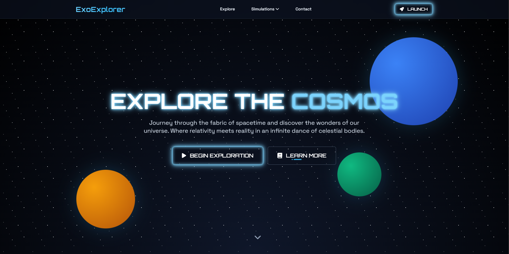 |   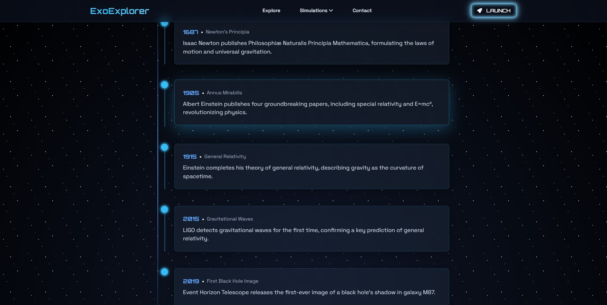
|-------------------------------------------------------|---------------------------------------------------------------| 
| *Exploreaza Cosmosul*                                 | *Evenimente Istorice*                                           

### 2. Simulare 3D

| 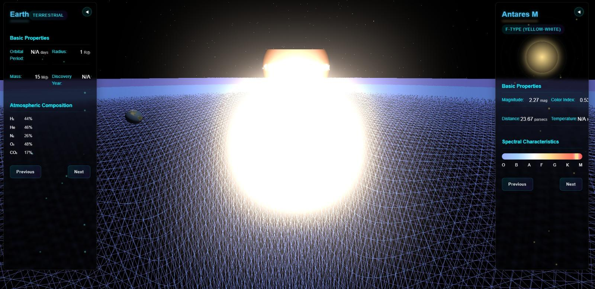 | 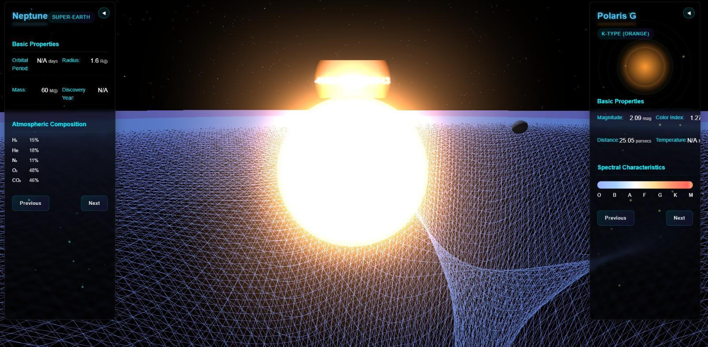   |
|-------------------------------------------------------|------------------------------------------------------------|
| *Pamantul si Antares M*                               | *Steaua Polaris si Neptun*                                 |

### 3. Simulare Relativitate
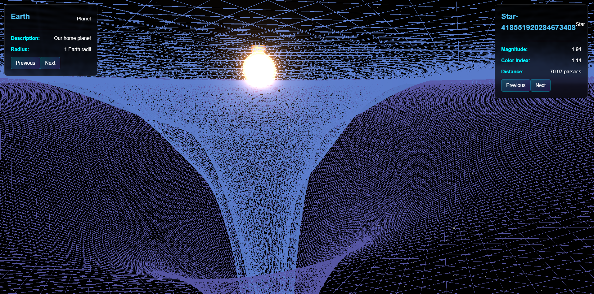  
*Curbura spațiului în jurul unei stele*

### 4. Dashboard Date
| 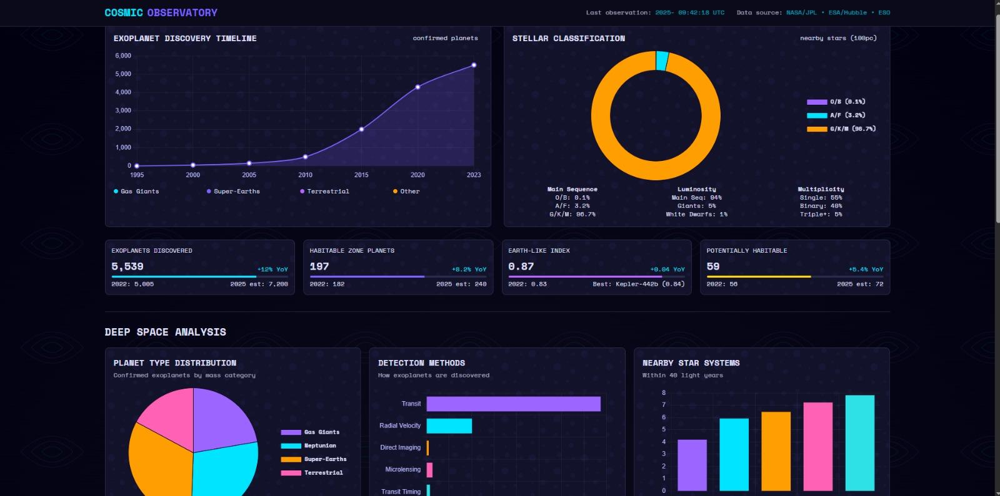 | 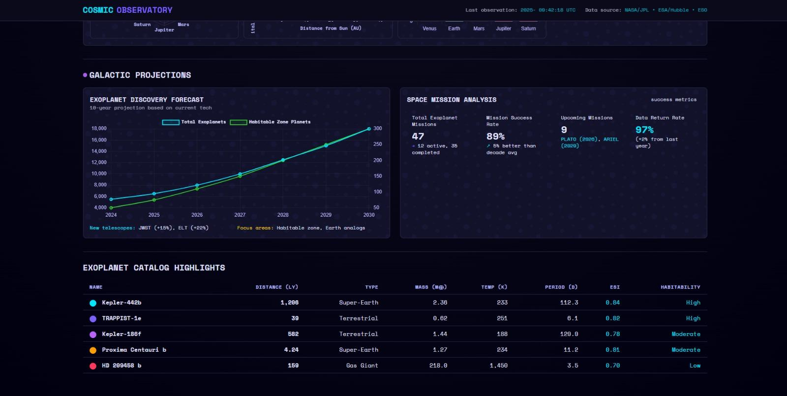 |
|-------------------------------------------------------------------|-----------------------------------------------------------------------|
| *Analiza date spatiale*                                           | *Exoplanete descoperite*                                              |

### 5. Modul Orbită
| 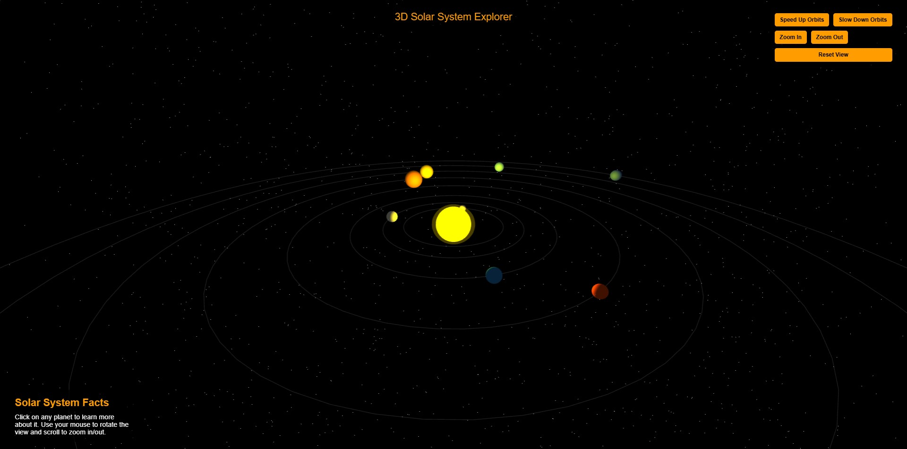 | 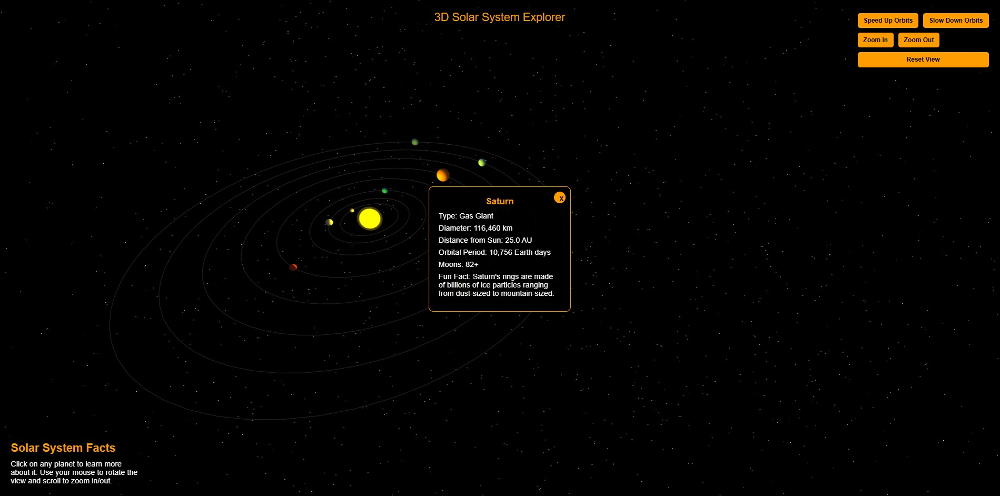 |
|-------------------------------------------------------------------|-----------------------------------------------------------------------|
| *Sistemul Solar*                                           | *Detalii Saturn*                                              |

### 6. Terra
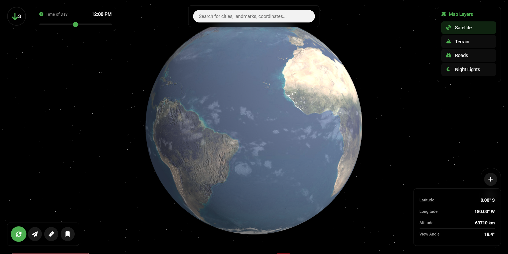  
*Terra*

### 7. Black Hole Simulator
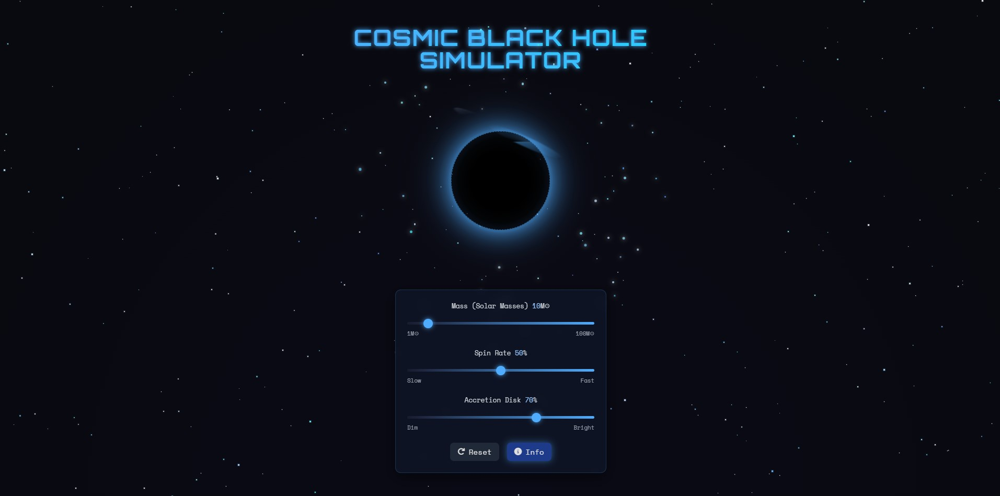  
*Simulare Gaura Neagra*

